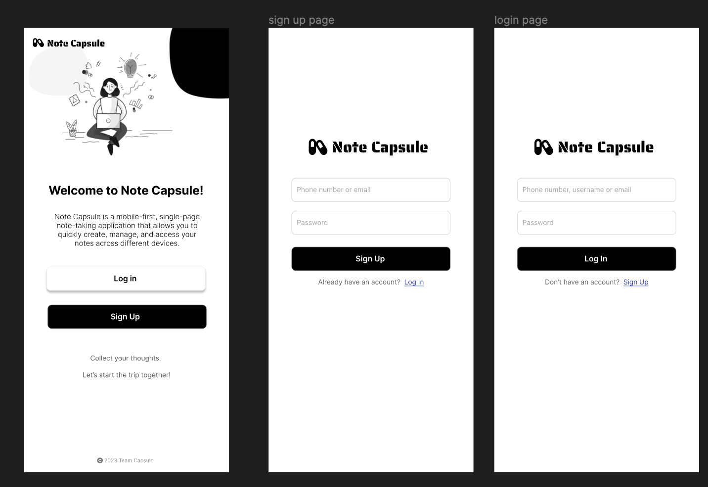

## Time-Capsule

https://note-capsule.netlify.app/

## Project Overview

Note Capsule aims to solve the issue of taking, organizing, and accessing notes quickly and efficiently across multiple devices. The application targets anyone who values structured and easy-to-access note-taking, such as students, professionals, writers, and researchers. Unlike other note-taking applications, Note Capsule offers a unique blend of simplicity, flexibility, and powerful features. Our focus on a clean, responsive interface, auto-saving, multimedia integration, and real-time collaboration sets us apart from the competition.

### Created By

- Youfu Yan
- Isabel Dahl
- Marcellinus Steven Sugiarto
- Ying Lu

## Key Features

- User Authentication(Clerk): Secure sign up and login functionality using Clerk.js with options for email, Google, or other social media logins.
- Notes Dashboard: Display a list of all notes with options to
  2.1 filter, 2.2 sort, 2.3 search, and organize them using 2.4 Folder. 2.5 Dark mode allows users to customize the interface to their liking.
- Note Editor: Rich text editor based on Quill.js that allows users to create, edit, and format notes with options for adding images, links, taking photos using the device's camera, and export notes as PDFs.
- Others: Automatically save notes as users type to prevent data loss using react hook. Image hosting using ImageKit.io
- Responsive Design: Our application is mobile-first and designed to adapt to different screen sizes. This is a core principle of PWAs, ensuring a consistent user experience across a range of devices.
- User Privacy: Cron job will run every every monday to delete images in imagekit that are not stored within the notes for user privacy reasons while improving data storage and bandwidth use.
- Future Features: Real-time collaboration, Data security and Privacy, Push notifications, and more.

Device supported:

- Iphone SE
- Pixel 5
- and more mobile devices

## Mockup images

**[Figma Prototype](https://www.figma.com/file/DR1Oxyx95T2sGyJcsxmc0v/Project2-LoFi?node-id=0%3A1&t=oNErMmuOGw5AKvIc-1) along with a very brief caption:**

### Login Page

### Dashboard Page

### Note Editor Page

## Testing Notes

- User need login first to use and test the app.

## Screenshots of Site (complete)

### Login Page

### Dashboard Page (Mobile)

### Dashboard Page (Desktop)

### Note Editor Page (Mobile)

## External Dependencies

- Clerk: User Authentication
- Quill.js: Note Editor
- React-Webcam: Webcam Integration
- ImageKit: Image Hosting
- Bootstrap: CSS Framework
- jspdf: PDF Generation

